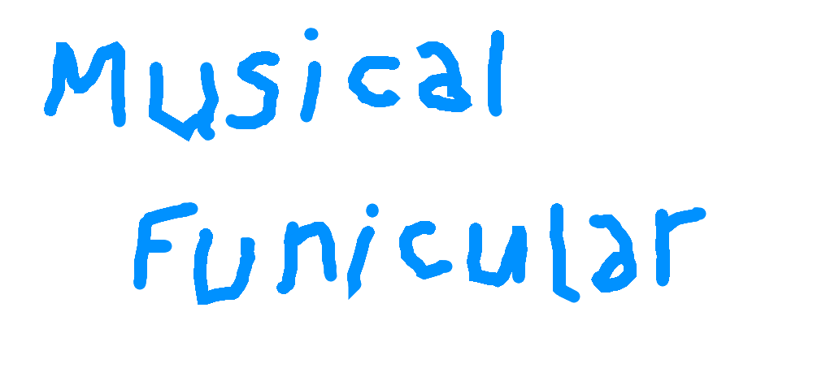

# Musical Funicular

The dumbest name ever. This project means to build an open source application engine based on the wonderful [Wren Language](https://wren.io/).

## Planned Features

- [X] Platform wrapper (window and input)
- [ ] Sprite batch renderer
- [ ] Audio system

## How to build

Simply clone the repository recursively. All the needed libraries are included as submodules. You will then need a C++17 compatible compiler and at least CMake 3.16 according to the CMakeLists.txt, but virtually any version could generate build files.

Since this project uses GLFW, if you are building it on Linux you will need to install a few more libraries on your system. If you are unsure, check [this page](https://glfw.org/docs/latest/build_guide.html).

## Contributions

All contributions are very welcome! Be it a bugfix or a new feature that you implemented, feel free to open a pull request. Also, if you are making a game or anything, do let me know. I would love to know how you are using the framework.

## License

Permission is hereby granted, free of charge, to any person obtaining a copy of this software and associated documentation files (the “Software”), to deal in the Software without restriction, including without limitation the rights to use, copy, modify, merge, publish, distribute, sublicense, and/or sell copies of the Software, and to permit persons to whom the Software is furnished to do so, subject to the following conditions:

The above copyright notice and this permission notice shall be included in all copies or substantial portions of the Software.

THE SOFTWARE IS PROVIDED “AS IS”, WITHOUT WARRANTY OF ANY KIND, EXPRESS OR IMPLIED, INCLUDING BUT NOT LIMITED TO THE WARRANTIES OF MERCHANTABILITY, FITNESS FOR A PARTICULAR PURPOSE AND NONINFRINGEMENT. IN NO EVENT SHALL THE AUTHORS OR COPYRIGHT HOLDERS BE LIABLE FOR ANY CLAIM, DAMAGES OR OTHER LIABILITY, WHETHER IN AN ACTION OF CONTRACT, TORT OR OTHERWISE, ARISING FROM, OUT OF OR IN CONNECTION WITH THE SOFTWARE OR THE USE OR OTHER DEALINGS IN THE SOFTWARE.